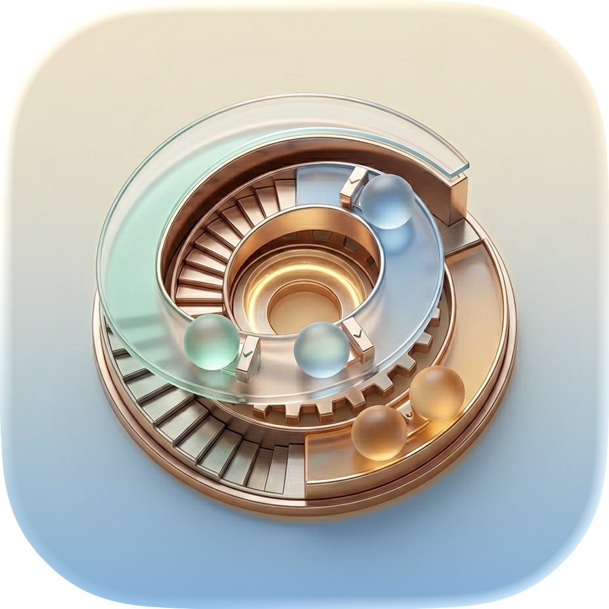
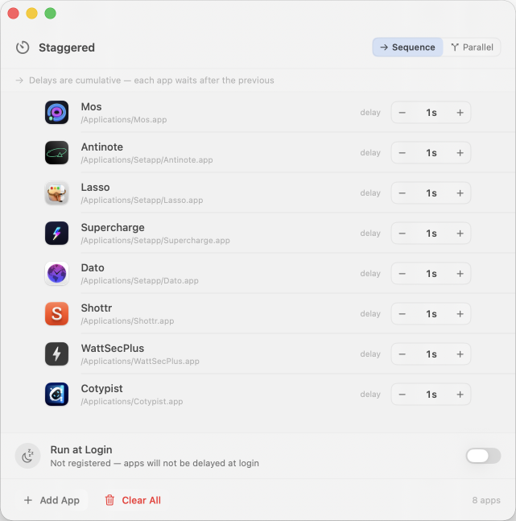

# Staggered

<div align="center">
  
</div>

A minimal, elegant macOS app that staggers app launches at login. No separate launcher needed — Staggered registers itself via a LaunchAgent and runs silently at boot to orchestrate app startups with precision timing.

<div align="center">
  
</div>

## Features

- ⏱️ **Stagger app launches** — Set individual delays for each app at login
- 🔄 **Dual modes** — Sequence (cumulative) or Parallel (simultaneous) timing
- 🎯 **Headless at login** — Launches silently in the background, no UI at startup
- 🚀 **Self-contained** — No separate launcher app needed; just one app to manage
- 📝 **Simple interface** — Add apps with just a click, adjust delays easily
- 🔐 **Secure** — Runs only on your machine, no external services

## How it works

- **Normal launch** (Finder, Dock, Spotlight) → displays the GUI
- **Login launch** → runs with `--login` flag, executes delayed launches silently, then exits

When you enable "Run at Login", Staggered writes a LaunchAgent plist to `~/Library/LaunchAgents/`. The plist stores the absolute app path and passes `--login`, so Staggered knows to run headlessly. Logs are written to `/tmp/staggered.log` for debugging.

## Installation

### Requirements

- macOS 13 Ventura or later
- Xcode Command Line Tools (for building)

### Build

```bash
xcode-select --install   # if not already done
chmod +x build.sh
./build.sh
```

### Install the app

Move the built app to a permanent location **before** enabling "Run at Login" — the LaunchAgent stores an absolute path:

```bash
cp -r "build/Staggered.app" ~/Applications/
open ~/Applications/Staggered.app
```

## Setup

1. Click **Add App** and select the applications you want to delay
2. Set a delay (in seconds) for each app
3. Choose launch mode:
   - **Sequence** — delays stack; each app waits for the previous to finish
   - **Parallel** — all timers run independently from boot
4. Toggle **Run at Login** to enable at startup

## Launch Modes

### Sequence
Delays are cumulative. Each app waits after the previous one launches.

Example: Apps with 1s and 3s delays → first app launches at t+1s, second at t+4s (1s + 3s)

### Parallel
All timers start simultaneously from boot.

Example: Apps with 1s and 3s delays → first app launches at t+1s, second at t+3s independently

## Debugging

Check the launch log:

```bash
cat /tmp/staggered.log
```

Verify the LaunchAgent is loaded:

```bash
launchctl list | grep staggered
```

Unload it manually if needed:

```bash
launchctl unload ~/Library/LaunchAgents/com.oliverbagley.staggered.plist
```

## Technical Details

- **Built with**: SwiftUI, AppKit
- **Code**: Minimal Swift implementation, no external dependencies
- **Configuration**: Stored in `~/Library/Application Support/Staggered/`
- **Launch method**: macOS LaunchAgent (runs at user login)
